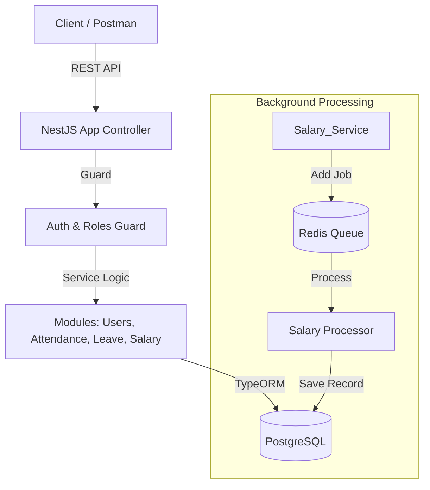

# Employee Management System (Backend)

This is my submission for the Backend Hiring Assignment.
It is a production-ready system built to manage employees, attendance, leaves, and salary processing. I focused on making the system robust, secure, and scalable.

## 1. Setup Steps (How to Run)

I have containerized the entire environment (Application, Database, and Queue), so you do not need to install Postgres or Redis manually.

**Step 1: Start the System**
Run the following command in the root directory:
```bash
docker-compose up -d --build
```
*(This will build the backend and start all required services)*

**Step 2: Access the API**
Once the containers are running, you can view the live Swagger documentation here:
**http://localhost:3000/api**

If you want to run the automated tests locally:
```bash
cd backend
npm install
npm run test
```

## 2. Architecture Overview

I designed the system using a Modular Monolith architecture in NestJS.
*   **API Gateway**: The Controller layer handles incoming REST requests.
*   **Guards**: A global Auth & Roles Guard intercepts requests to enforce RBAC.
*   **Services**: Business logic is isolated in specific domains (User, Salary, etc.).
*   **Async Worker**: Salary calculation is offloaded to a Redis Queue (BullMQ) to prevent blocking operations.



## 3. API List (Key Endpoints)

While the full list is in the Swagger UI, here are the core endpoints I implemented:

*   **Authentication**
    *   `POST /auth/login` (Returns JWT Token)
*   **Employee Management**
    *   `POST /users` (Create User - Admin Only)
    *   `GET /users/profile` (View own profile)
*   **Attendance**
    *   `POST /attendance/clock-in`
    *   `POST /attendance/clock-out`
    *   `GET /attendance/my-attendance` (History)
*   **Leave Management**
    *   `POST /leave` (Apply for leave)
    *   `PATCH /leave/:id/status` (Approve/Reject - Manager Only)
*   **Salary System**
    *   `POST /salary/generate` (Trigger calculation job)
    *   `GET /salary/my-salary` (View payslips)

## 4. Business Logic Notes

I implemented the specific rules requested in the assignment:

*   **Salary Calculation**: The monthly salary is calculated using the formula: `(Base Salary / 30) * Present Days`.
*   **Leave Overlap**: The system explicitly checks if a user already has an approved leave for a requested date range to prevent overlaps.
*   **Hierarchy Loop Prevention**: A manager must be a `Team Lead` or `Admin`. An `Employee` cannot be assigned as a manager to ensure a proper reporting structure.
*   **Role-Based Access**: I used custom Decorators (`@Roles`) to ensure strict permission boundaries (e.g., only Admins can create users).

---

## Technical Stack & Design Decisions

*   **Framework**: NestJS (Modular Architecture)
*   **Database**: PostgreSQL with TypeORM
*   **Queue System**: BullMQ with Redis
*   **Security**:
    *   **Docker**: Hardened Multi-Stage Build (Node 24 Alpine).
    *   **Vulnerabilities**: Automated `npm audit` inside the build process.
    *   **Input**: Strict validation using `class-validator` DTOs.
